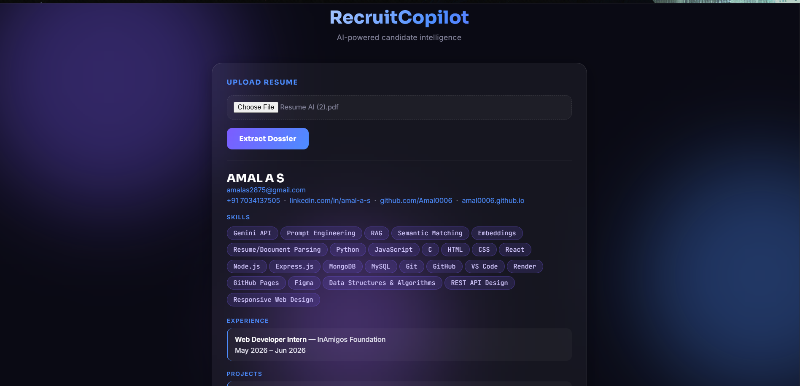
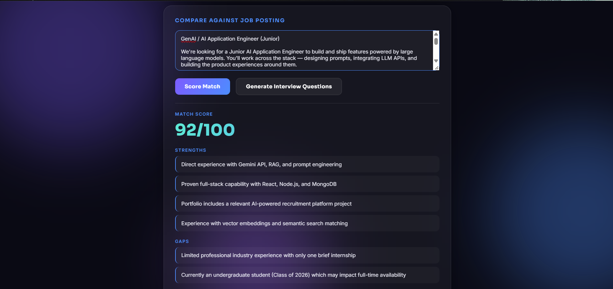
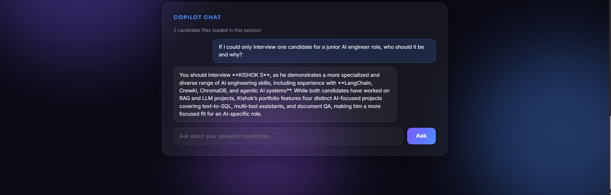

# RecruitCopilot

AI-powered candidate intelligence platform — resume parsing, job-match scoring, a RAG-style recruiting chat copilot, and AI-generated interview questions.

**Live demo:** https://recruit-copilot.vercel.app
*(Backend runs on Render's free tier — the first request after a period of inactivity can take 30–60s to wake up. Subsequent requests are fast.)*

## Screenshots

| Dossier Extraction | Match Score | Copilot Chat |
|---|---|---|
|  |  |  |

## Features

1. **Resume Parsing** — Upload a PDF resume; an LLM extracts structured data (name, contact info, skills, experience, education, projects) as clean JSON.
2. **Job-Match Scoring** — Paste a job description; the AI scores the candidate's fit (0–100) with specific strengths and gaps.
3. **Recruiting Copilot Chat** — Ask natural-language questions across all uploaded candidates ("Which candidates know React?"), answered using a RAG-style pattern grounded in the parsed resume data.
4. **Interview Question Generator** — Generates technical, behavioral, and gap-probing questions tailored to the specific candidate and job posting.

## Tech Stack

- **Frontend:** HTML/CSS/JS (vanilla), deployed on Vercel
- **Backend:** Node.js, Express, deployed on Render
- **Database:** MongoDB Atlas
- **AI:** Google Gemini API (`gemini-3-flash-preview`)
- **PDF parsing:** `pdf-parse`

## Evaluation Results

A small, informal evaluation run against a real resume and a matching job posting:

| Task | Result |
|---|---|
| Resume parsing accuracy | Correctly extracted all fields (name, email, phone, LinkedIn, GitHub, portfolio, 21 skills, 1 work experience entry, 4 projects, 3 education entries) from a real PDF resume with zero manual correction needed |
| Job-match scoring | Given a Front-End Developer job posting, scored a matching candidate **78/100**, correctly identifying strengths (React, Figma, UI/UX) and gaps (no Jest/Cypress, no AWS) |
| Chat copilot accuracy | Asked "Which candidates have React experience?" across 3 uploaded resumes — correctly identified 2 matching candidates by name and correctly excluded the 1 non-matching candidate |
| Interview question relevance | Generated technical questions correctly referenced the candidate's actual named projects (e.g. "In your 'Task Tracker' app, how did you implement CRUD operations...") rather than generic questions |

*(This is a small-scale, informal evaluation on real test data during development — not a rigorous benchmark. Future iterations could formalize this with a larger labeled test set.)*

## Architecture Notes

- Resumes are stored in MongoDB for persistence across server restarts; an in-memory array is used as a fast cache within a session.
- Chat context is built by passing all stored candidate JSON directly into the prompt ("context stuffing") rather than using vector embeddings — a reasonable approach at small scale, with vector search as a natural next upgrade for larger candidate pools.
- CORS is restricted to the deployed frontend origin.

## Running Locally

```bash
# Backend
cd backend
npm install
# create a .env file with GEMINI_API_KEY and MONGODB_URI
node server.js

# Frontend
# open frontend/index.html directly in a browser
# (update the API_BASE constant in index.html if pointing at a local backend)
```

## Known Limitations

- Free-tier backend hosting means occasional cold-start delays.
- Resume data extraction is only as good as the LLM's reading of the PDF text — unusual PDF layouts may extract less cleanly.
- No authentication — this is a portfolio/demo project, not production-ready for handling real candidate PII.